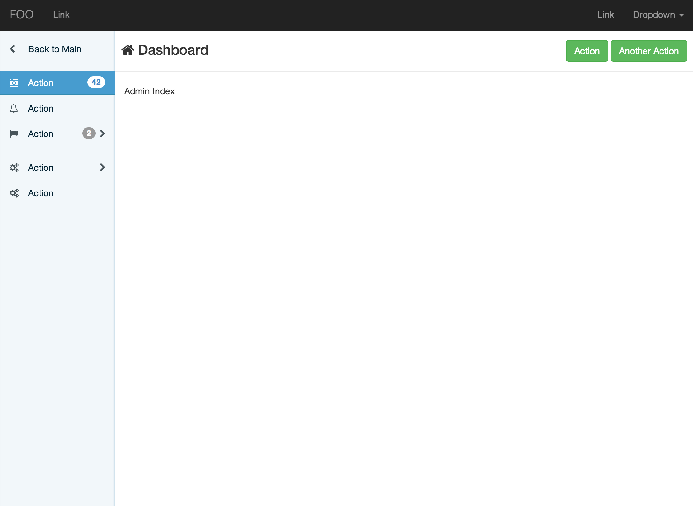
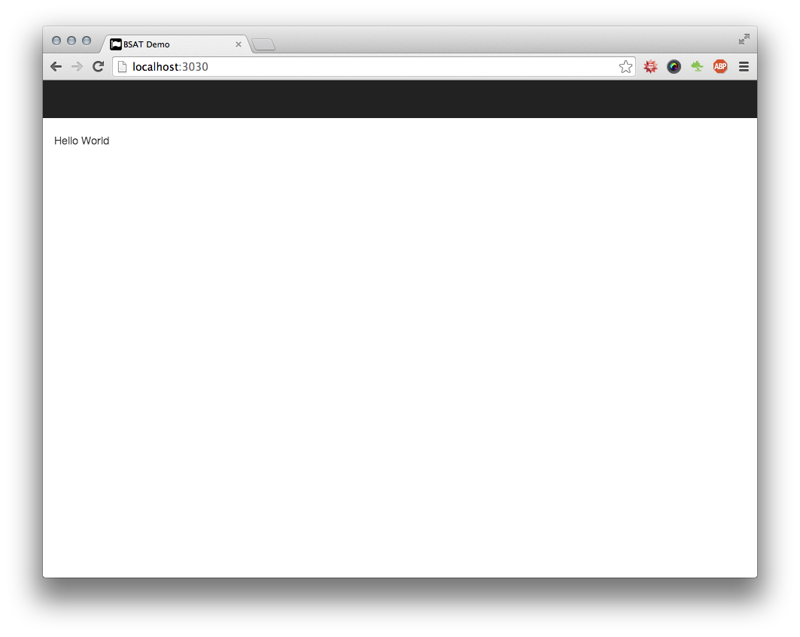
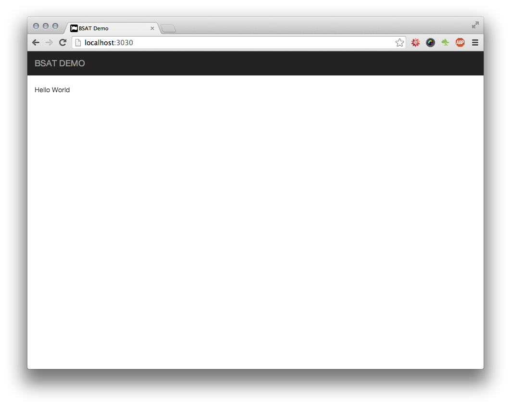
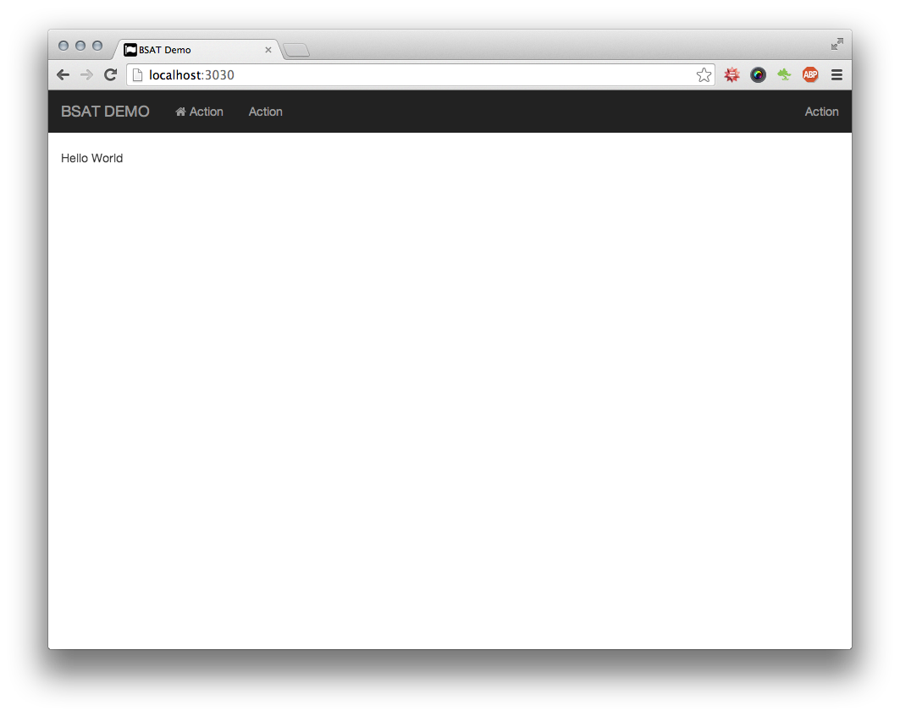
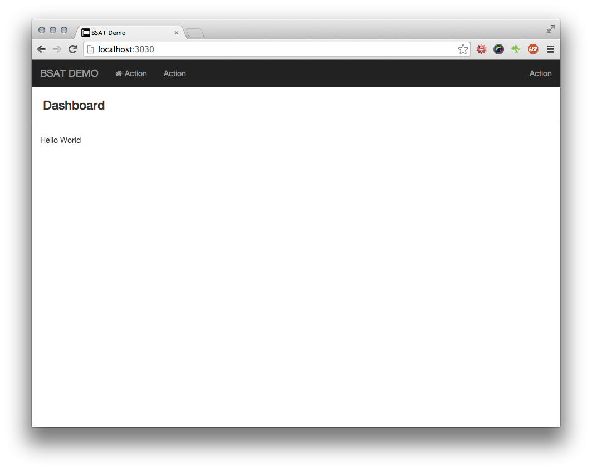
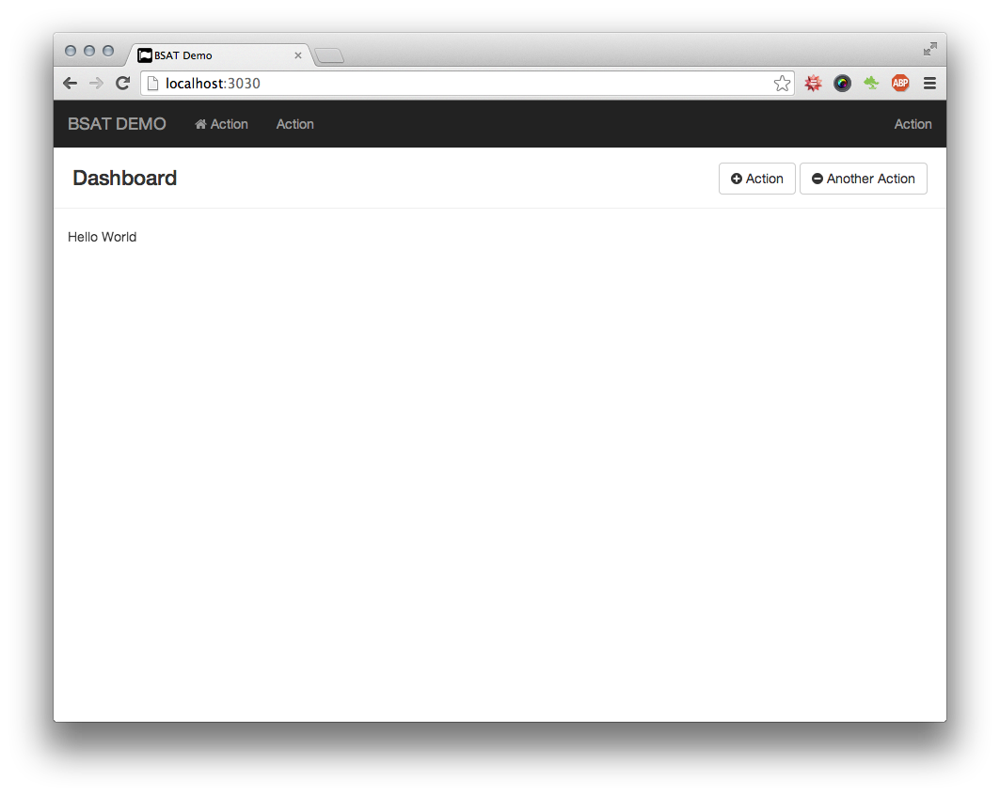
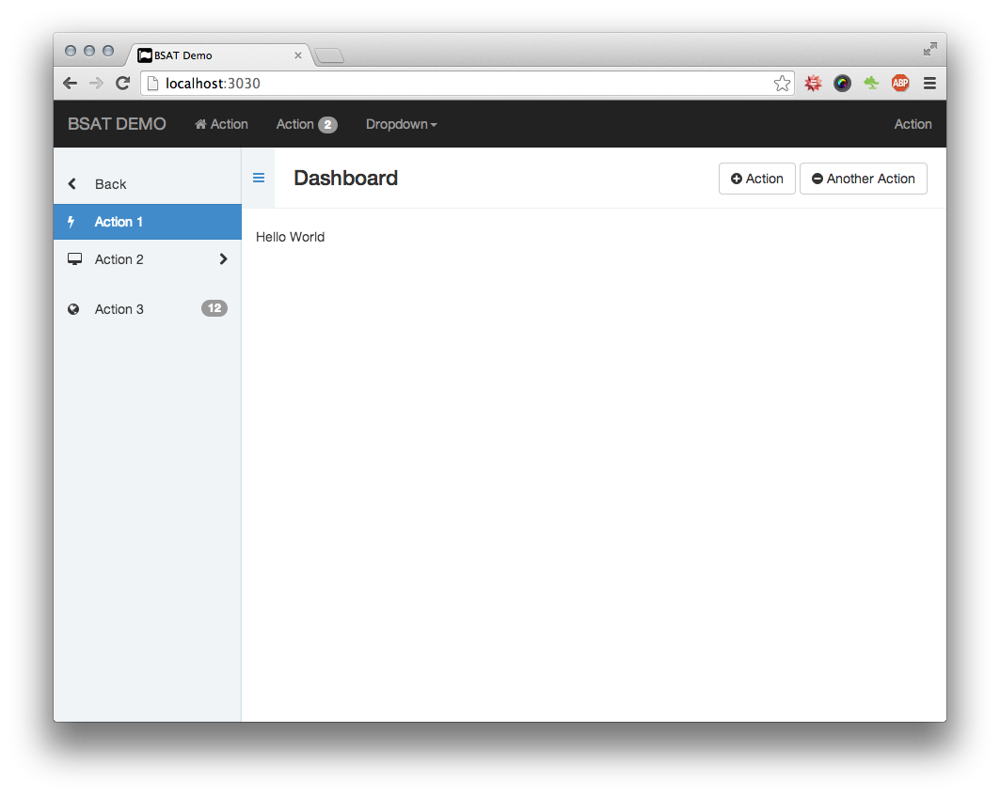

BSAT
----

[](https://codeclimate.com/github/renspr/bsat)
[](https://gemnasium.com/renspr/bsat)

BSAT is an admin template build with Bootstrap 3 packaged as a Rails engine. With BSAT it's
easy to build a nice and uniform admin backend for your Rails project that works on
desktops, tablets and smartphones. Based on Bootstrap 3 BSAT adds some ready to use UI elements
and Rails helpers.

By default BSAT gives you the following UI. It's your job to fill out the gaps. Need styling?
It's Bootstrap 3!




Dependencies
------------

BSAT is closely coupled with the following dependencies. As BSAT is mainly developed for
in-house use, reducing dependcies is not our primary goal.

* [rails](http://rubygems.org/gems/rails),                           ~> 4.0
* [sass-rails](http://rubygems.org/gems/sass-rails),                 ~> 4.0
* [bootstrap-sass](http://rubygems.org/gems/bootstrap-sass),         ~> 3.1
* [coffee-rails](http://rubygems.org/gems/coffee-rails),             ~> 4.0
* [compass-rails](http://rubygems.org/gems/compass-rails),           ~> 1.1
* [jquery-rails](http://rubygems.org/gems/jquery-rails),             ~> 3.1
* [font-awesome-rails](http://rubygems.org/gems/font-awesome-rails), ~> 4.0
* [slim](http://rubygems.org/gems/slim),                             ~> 2.0

BSAT will also include the following Javascript librarys.

* [iscroll](http://iscrolljs.com/), ~> 5.0


Installation
------------

Add it to your Gemfile (__Note__: we have no official release yet, so you need to use the github source at the moment):

```ruby
gem 'bsat', '> 0.0.1', github: 'renspr/bsat', branch: 'master'
```

Run the following command to install it:

```console
bundle install
```

### Sass

Import BSAT into a Sass file (for example, `application.css.scss`) to get all of BSAT's styles, mixins and variables!

```scss
@import "bsat";
```

The full list of BSAT variables can be found [here](https://github.com/renspr/bsat/blob/master/app/assets/stylesheets/bsat/_variables.scss). You can override these by simply redefining the variable before the `@import` directive, e.g.:

```scss
$bsat-sidebar-width: 250px;
...

@import "bsat";
```

__Please note:__  You need to require `bootstrap` manually before you require `bsat`.

### Javascript

We have a helper that includes all BSAT javascripts. Put this in your Javascript manifest (usually in `application.js`) to load the files in the correct order.

```js
// Loads all BSAT javascripts
//= require bsat
```

__Please note:__ You need to require `jquery` and `bootstrap` manually before you require `bsat`.


Usage
-----

BSAT works by defining a bunch of `content_for` variables that finally renders into the bsat template. We provide Rails helpers to help you defining the _right_ content.

### Render BSAT layout

In your application layout file you normally would call `= yield` (note we are using slim syntax here) where the main content should be rendered. To render BSAT all you have to do ist to call

```slim
= bsat(yield)
```

A complete example may look like this

```slim
doctype html
html(lang="de")
  head
    meta(charset="utf-8")
    meta(name="viewport" content="width=device-width, initial-scale=1, maximum-scale=1, user-scalable=no")

    title BSAT Demo

    = stylesheet_link_tag    "application", "data-turbolinks-track" => true, "media" => "all"
    = javascript_include_tag "application", "data-turbolinks-track" => true
    = csrf_meta_tag

  body
    = bsat(yield)
```

The result is an empty BSAT view that looks like this



### Brand

To set the brand there is a helper called `bsat_brand`. You should provide the `title` and the `path/url` where
the `title` is linked to.

```slim
- bsat_brand title: 'BSAT DEMO', path: root_path
```



The helper also excepts a block that allows you to provide more than just a title string.

```slim
- bsat_brand path: root_path
  => fa_icon 'group'
  = "Foo Bar"
```

### Navbar

For the navbar we provide a helper to create links on the left and on the right side of the navbar. The helper
is called `bsat_navbar`. It accepts one argument to set the side `:left` or `:right` and a block to set the links.

```slim
- bsat_navbar(:left) do |navbar|
  - navbar.link 'Action', '#', icon: 'home'
  - navbar.link 'Action', '#', badge: 2
  - navbar.dropdown 'Dropdown' do |dropdown|
    - dropdown.link 'Action', '#'
    - dropdown.link 'Action', '#'
    - dropdown.link 'Action', '#'

- bsat_navbar(:right) do |navbar|
  - navbar.link 'Action', '#'
```



### Page title

For a page you can set a title using the `bsat_page_title` helper.

```slim
- bsat_page_title 'Dashboard'
```



### Page actions

On the right side of the page header section you can create page actions using the `bsat_page_actions` helper.
The helper expects a block defining the actions. Each action will result in a button on large displays. On smaller
devices the button will become a dropdown menu.

```slim
- bsat_page_actions do |actions|
  - actions.add 'Action', '#',         icon: 'plus-circle'
  - actions.add 'Another Action', '#', icon: 'minus-circle'
```



### Sidebar

BSAT provides a nice sidebar that will collapse on small screens. To create the sidebar navigation use
the `bsat_sidebar_nav` helper.

```slim
- bsat_sidebar_nav do |nav|
  - nav.back 'Back', '#'
  - nav.content do
    b = 'My content here'
  - nav.link 'Action 1', '#', icon: 'bolt',    active: /\A\//
  - nav.link 'Action 2', '#', icon: 'desktop', active: /bar/, has_sublevel: true
  - nav.divider
  - nav.link "Action 3", '#', icon: 'globe',   active: /baz/, badge: 12
```

__Protip™__: Define your sidebar navigation in layouts and use Rails nested layouts feature to simulate
navigation nesting.



### Nested Form Fields

When using nested_forms, BSAT provides a helper to style them adequately.
For example, your `_form.html.slim` contains this code:
```slim
= f.fields_for :tasks
```
You can now have a `_task_fields.html.slim` that adds the fields with the helper.
```slim
= bsat_nested_form_fields(f) do
  = f.input :title
```
